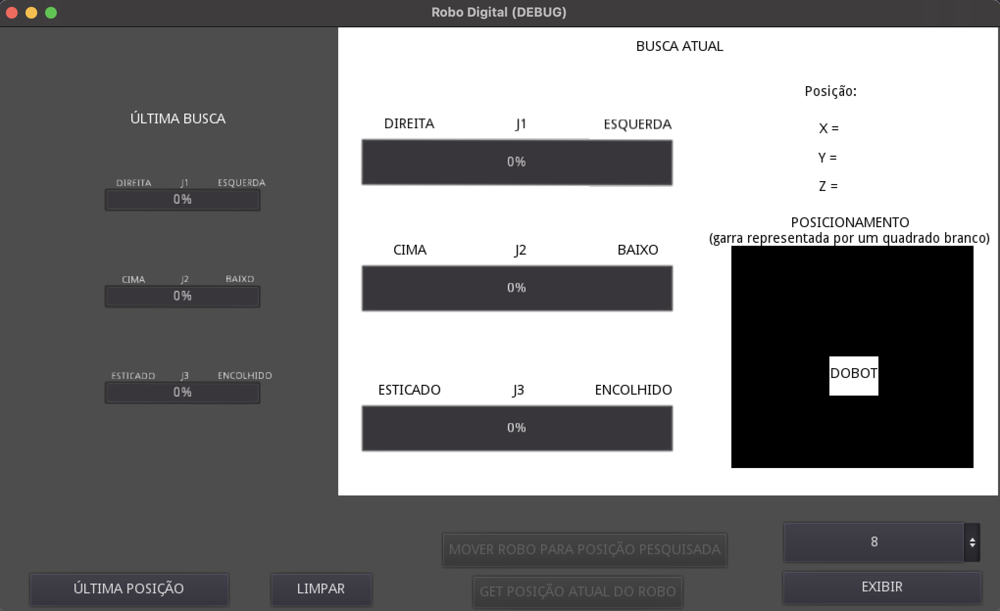
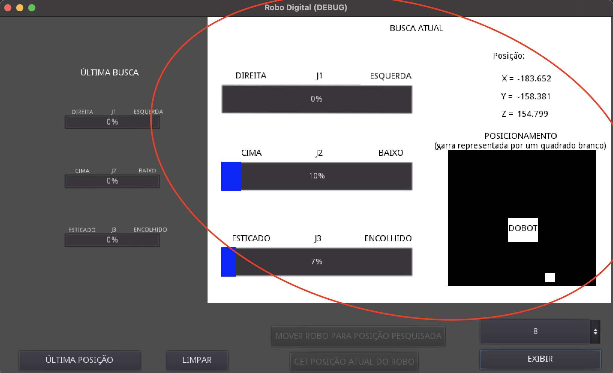
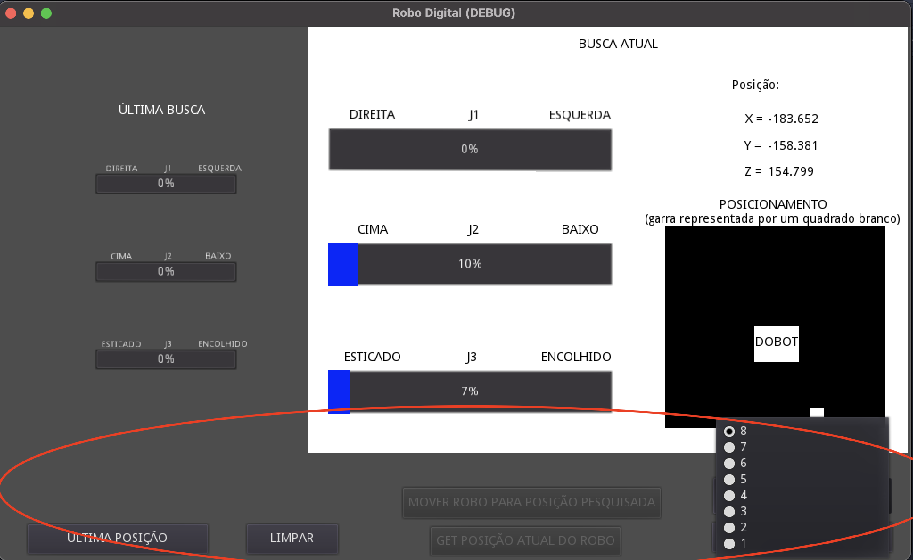
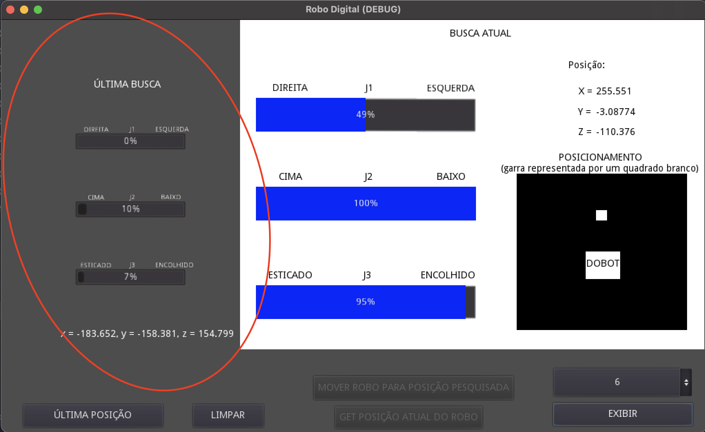
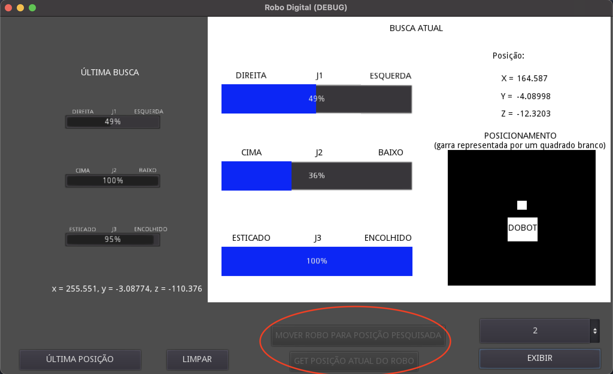

# Projeto avaliado para a faculdade Inteli - Robo Digital

## Objetivo

Esse repositório tem o objetivo de explicar e armazenar os códigos para uma atividade avaliada da minha faculdade, a Inteli.  
Essa atividade consiste na elaboração de um backend feito em flask o qual alimentará um ambiente de simulação criado utilizanod a engine GODOT.

Os códigos estão divididos nas seguintes pastas:

- `src/api` -> contém os códigos do servidor em flaks, da classe que se refere à tabela no banco de dados em MYSQL, o "dump" do banco de dados MYSQL e os arquivos de configuração do Docker (Dokerfile e docker-compose).
- `src/godot` -> contém os código do ambiente de simulação criado na engine GODOT e em `src/godot/interface_executavel` o executável para Windows do ambiente de simulação.

## Backend

A função principal do backend/api é alimentar o ambiente de simulação com as informações das juntas e coordenadas da garra do robô.
As tecnologias utilizadas na construção da backend/api são:

- Flask
- ORM flask_sqlalchemy
- Docker
- MYSQL
  O backend é construido em flask, terá MySQL como banco de dados e tudo está conteinerizado.

**Flask**  
 Há dois arquivos python: `__init__.py` e `migrations.py`. O primeiro contém toda a lógica básica para rodar o servidor. Já o segundo, contém a classe para o esquema da tabela no banco de dados e caso necessário, as funções para criar as tabelas no banco de dados.

**Docker**  
 Há dois arquivos para a dockerização da backend/api: `Dockerfile` e `docker-compose.yml`. O primeiro é responsável por configurar a build do python de acordo com a necessidade da aplicação. Já o segundo, é responsável por configurar e manejar dois containers: o para o python e o para o banco de dados MySQL.

## Ambiente de simulação

O ambiente de simulação tem o objetivo de demonstrar o suposto comportamento da garra do robô de acordo com a configuração das suas juntas.

### A interface



A interface é composta por 3 campos principais:

**Resultado das juntas:** o campo circulado em vermelho. Nele, é demosntrado uma porcentagem relativa de cada junta e o que ela mais se aproxima dos seus estremos, como nesse exemplo podemos ver que o resultante da primeira junta é o braço robótico estar o máximo para a direita possível. Podemos ver também um esboço do local em que a garra estaria, no canto inferior da direita. Esse esboço leva em consideração que a frente do robô equivale à direção do campo superior da região delimitada em preto.


**Campo de pesquisa:** o campo circulado em vermelho. Nele, há algumas opções de busca nos dados armazenados no banco de dados. Nele, podemos pesquisar apenas a última posição armazenada no banco de dados, ou navegar entre os ids especificados no botão contendo o número 8(número correspondente ao id 8 no banco de dados).


**Busca anterior:** para facilitar as buscas, há um espaço que armazena as configurações das juntas em sua última pesquisa.


**Interação com o robô:** caso o sistema detecte o robô conectado em sua máquina os seguintes botões estarão disponíveis. O primeiro deles(seguindo uma ordem de cima para baixo) é para colocar as juntas do robô real na mesma configuração que está sendo demonstrada no quadrante principal. O segundo botão é para caso o usuário deseje adicionar uma nova posição do robô no banco de dados. Caso o robô não seja identificado, os botões ficaram indisponíveis.


## Como rodar o projeto

Podemos rodar o projeto de duas maneiras:

1.  Com python nativo em seu computador
2.  Com Docker

### Python nativo

_Observação: altere as credenciais e a url do banco de dados MySQL definidos no arquivo `src/api/__init__.py` e importe os dados localizado em `src/api/mysql-dump/schema.sql`._
Rode os seguintes comandos em `/src`

```shell
pip install -r requirements.txt
```

Em windows:

```shell
pyp __init__.py
```

Em mac:

```shell
python3 __init__.py
```

Pronto, o projeto já estará rodando em localhost!

_Observação:_ Caso deseje criar as tabelas sem nenhum dado rode o seguinte comando antes de rodar o arquivo `__init__.py`:
Em windows:

```shell
pyp migrations.py
```

Em mac:

```shell
python3 migrations.py
```

### Docker

Rode os seguintes comando em `/src`

```shell
docker compose up
```

Pronto, o projeto já estará rodando em um container é poderá ser acessado em `localhost:3001` e o banco de dados `localhost:3002`!

_Observação: caso o projeto rode em docker, não será possível conectar com o Dobot Magician Lite pois não foi feita a configuração no docker-compose_
